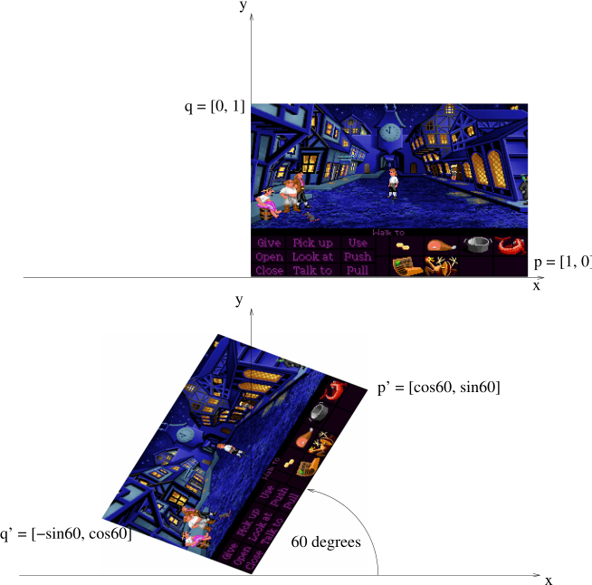

# Making class slides in Quarto instead of Beamer

A working tutorial for GAME 220. It assumes you know Beamer and want the
equivalent moves in Quarto, not an introduction to either.

Everything below was tested against this folder on this machine. Where
something does not work, it says so and says what to do instead.

- [1. The mental model](#1-the-mental-model)
- [2. Setup](#2-setup)
- [3. Creating a deck](#3-creating-a-deck)
- [4. Writing slides](#4-writing-slides)
- [5. Figures](#5-figures)
- [6. Interactive labs](#6-interactive-labs)
- [7. Presenting](#7-presenting)
- [8. Sharing](#8-sharing)
- [9. Bringing an old Beamer deck across](#9-bringing-an-old-beamer-deck-across)
- [10. Troubleshooting](#10-troubleshooting)

---

## 1. The mental model

Beamer compiles LaTeX to a PDF. Quarto compiles Markdown to an HTML page that
happens to be a slideshow, driven by reveal.js.

| | Beamer | Quarto |
| --- | --- | --- |
| you write | `.tex` | `.qmd` (Markdown + YAML) |
| build | `pdflatex` | `quarto render` |
| output | `main.pdf` | `matrices.html` + a folder |
| present with | any PDF viewer | a browser |
| math | LaTeX | LaTeX (MathJax) — **identical** |
| interactivity | none | anything the web can do |

The one that matters: **your math carries over untouched.** `pmatrix`,
`\sqrt`, `\angle`, `\vec`, `\hat`, `\frac` all work exactly as they did. That
is most of both your decks, and it is why this migration is transcription
rather than rewriting.

The one real cost: **output is a folder of files that must be served over
http**, not a single portable PDF. Section 8 deals with that honestly.

---

## 2. Setup

Already done on this machine. To redo it elsewhere:

```powershell
winget install --id Posit.Quarto -e
```

That is the whole dependency list. Quarto bundles pandoc and reveal.js, and the
labs are plain JavaScript in `assets/` — no npm, no network, nothing vendored.

Check it:

```powershell
quarto --version      # 1.10.18 here
```

---

## 3. Creating a deck

### Start a new one

Create `kinematics.qmd` in this folder:

```markdown
---
title: "GAME 220 - Game Dynamics 1"
subtitle: "Kinematics"
---

## First slide

Content.
```

That is a complete deck. Everything else — theme, footer, slide numbers,
chalkboard, the lab script — is inherited from `_quarto.yml`, which
applies to every `.qmd` in this folder. You do not repeat the preamble in each
deck the way you did in each `.tex`.

### The edit loop

```powershell
quarto preview kinematics.qmd
```

This opens a browser and **live-reloads on every save**. Leave it running in a
terminal while you write. This is the biggest day-to-day difference from
Beamer — no compile step, no waiting, no `.aux` files.

When done, `Ctrl+C`. To build everything without previewing:

```powershell
quarto render
```

### What lands on disk

`kinematics.html` plus `kinematics_files/`, both beside the `.qmd`. They sit
next to `assets/` and `figs/`, which is why relative paths resolve. Keep them
together.

Edits to `assets/*.css` and `assets/*.js` do **not** need a re-render — just
reload the page.

---

## 4. Writing slides

### Structure

```markdown
# Section title            <- a section divider slide
## Slide title             <- a normal slide
### Heading inside a slide
```

`#` replaces `\section{}`, `##` replaces `\begin{frame}\frametitle{}`. There is
no `\end{frame}`; the next `##` ends the slide.

### Pauses

`\pause` becomes a line containing `. . .` — three dots, spaces between,
nothing else:

```markdown
## Dot product

$\vec{A}\cdot\vec{B} = |A||B|\cos\theta$

. . .

In Cartesian form: $x_1x_2 + y_1y_2$
```

For a list that reveals one bullet at a time:

```markdown
::: {.incremental}
- First
- Second
:::
```

### Columns

`\begin{columns}` becomes fenced divs. Note the **four** colons on the outer
fence and three on the inner — that is how nesting is expressed:

```markdown
:::: {.columns}

::: {.column width="55%"}
Left side.
:::

::: {.column width="45%"}

:::

::::
```

### Math

Inline `$...$` and display `$$...$$`, same as always:

```markdown
$$R(\theta) = \begin{pmatrix} \cos\theta & -\sin\theta \\
                              \sin\theta & \cos\theta \end{pmatrix}$$
```

`\degree` and your other `\newcommand` shortcuts do not exist here. Write
`^\circ` directly. If you want the shortcuts back, define them once in a hidden
math block at the top of the deck:

```markdown
$$\newcommand{\degree}{^\circ}$$
```

### Your Beamer macros

| Beamer | Quarto |
| --- | --- |
| `\alert{x}` | `[x]{.alert}` |
| `\struc{x}` / `\structure{x}` | `[x]{.struc}` |
| `\fbox{$...$}` | `$\class{boxed}{...}$` |
| `\bi \bu ... \ei` | `-` bullets |
| `\ben \bu ... \een` | `1.` numbered |
| `\includegraphics[width=6cm]{f.eps}` | `{width="60%"}` |

`.alert`, `.struc` and `.boxed` are defined in `assets/slides.css` to match the
old beaver colour scheme. Prefer relative widths (`60%`) over centimetres — the
slide scales to the projector.

### Slide options

Put them in braces after the title:

```markdown
## A dense slide {.smaller}      <- shrinks text, the fix for overflow
## A quiet slide {.center}       <- vertically centred
## Skip me {visibility="hidden"} <- kept in source, not shown
```

### Speaker notes

```markdown
::: {.notes}
Remind them the order matters here. Ask why TR and RT differ.
:::
```

Press `s` while presenting to open the speaker view in a second window.

---

## 5. Figures

The browser cannot display EPS. Everything must be SVG, PNG, or JPG. SVG is
what you want — it is line art and stays sharp at any projector resolution.

All 69 EPS figures from both old decks are already converted in `figs/`.

To convert more (from Git Bash, not PowerShell):

```bash
./tools/eps2svg.sh ../matrices ../vectors
FORCE=1 ./tools/eps2svg.sh ../vectors     # redo ones already done
```

If you still have the xfig `.fig` originals, skip EPS entirely — `fig2dev -L
svg drawing.fig drawing.svg` goes straight to a clean SVG.

Use them like this:

```markdown
{width="55%"}
```

Captions are suppressed by the theme, so alt text in the brackets is optional.

---

## 6. Interactive labs

This is the reason to be here at all. A lab is one `<div>` in the `.qmd`;
`assets/labs.js` finds it and mounts the demo, almost always on a Canvas 2D
stage (`matmul`, below, is the one exception - plain DOM, no stage).

```html
<div class="lab-mount" data-lab="2d" data-stages="rotate,translate"
     data-theta="60" data-dx="3" data-dy="0"></div>
```

Six kinds exist, chosen with `data-lab`:

| `data-lab` | what it does |
| --- | --- |
| `2d` (default) | matrix transforms — two tracked vertices, a shape, the composed 3×3 |
| `polar` | drag a vector; read $[a,b]$ and $r\angle\theta$ off it |
| `add` | tip-to-tail addition, with an A+B / A−B toggle |
| `dot` | dot product, and the projection onto $\hat{B}$ |
| `reflect` | the non-axis-aligned collision, following the five steps |
| `matmul` | step through $A \times B$ row by column, one cell of the product at a time |

Common options: `data-view` (half-height in world units), `data-matrix="false"`,
and for `2d` also `data-stages`, `data-shape`, `data-reorder` and the starting
slider values `data-theta` / `data-kx` / `data-ky` / `data-dx` / `data-dy`. The
vector labs take `data-cx`, `data-cy`, `data-step`, `data-dp` for the camera and
number formatting, and `reflect` takes `data-preset="peggle"`. The full table is
in [README.md](README.md).

Every slider's number doubles as a text box - click it to type an exact value
(Enter or click away commits, Escape cancels) instead of dragging the thumb.
Out-of-range text clamps to the slider's min/max; unparsable text reverts.

The `2d` lab, given more than one stage, grows a row of words above the
matrix — e.g. `Rotate × Translate =` — that can be dragged left-to-right into
any order, the way you'd rearrange terms in a written-out matrix product.
Drag, then **Play**, and the same θ, scale and Δ visibly land somewhere else.
That is the slide that used to be four lines of algebra. The row is
multiplication order, not application order: the rightmost word is applied
first, matching how `TR` in the algebra reads "rotate, then translate."

The vector labs are dragged, not sliders: the black dots are handles. Two of
them are tuned to match the printed worked examples, so you can put the demo
and the algebra side by side and the numbers agree:

- `polar` starts at $[2, 3]$ and reads $3.61 \angle 56.3^\circ$.
- `reflect` with `data-preset="peggle"` uses the Peggle coordinates and reads
  $\hat{N} = [0.832, -0.555]$, $v_f = [-10, 50]$.

To add a new kind of lab, write a mode in `assets/vector-lab.js` — each one is
a `handles` list, a `draw()` that returns shapes and readout rows, and nothing
else. The scene, dragging, and layout come from `assets/lab-core.js`.

### Testing the demos

Two levels, and it is worth doing both after any change to `assets/*.js`.

**Automated.** Run `serve.cmd` and open
<http://localhost:8000/lab-selftest.html>. It mounts every lab, synthesises
real pointer drags and slider moves, reads the numbers back out of the panels,
and compares them against values worked out by hand. You want
`all 78 checks passed` in green at the top. This covers what a screenshot
cannot: that a handle can be grabbed, that dragging updates the readout, and
that the arithmetic is right at more than one position. It also asserts each
lab was drawn by Canvas 2D, since the readouts alone cannot tell you that.

If you add a lab, add a few checks — the pattern for each is "drag from a known
point to another known point, then assert the readout".

**By hand,** because the self-test cannot judge whether something *reads* well
from the back of a room:

| lab | try this | expect |
| --- | --- | --- |
| `2d` | drag θ to 90° | matrix goes to $[0, -1; 1, 0]$, house rotates a quarter turn |
| `2d` | click the θ value, type `45`, Enter | matrix and house match dragging to 45° exactly |
| `2d` | drag a word to reorder, then **Play** | the house ends somewhere else |
| `polar` | drag the tip to $(3, 4)$ | $r = 5$, $\theta = 53.1^\circ$ |
| `add` | drag A onto B | resultant doubles |
| `dot` | swing A past $90^\circ$ from B | projection goes negative |
| `reflect` | drag a boundary end | $\hat{N}$, $P$ and $v_f$ all follow |

Then check it at the size you will actually present at: press `f` for
fullscreen and stand back. Handles are 22 px targets, which is comfortable with
a mouse and tight on a trackpad.

To iterate on a lab without re-rendering a deck, run `serve.cmd` and open
<http://localhost:8000/lab-preview.html> — all four labs on one plain page.

**Keep an algebra slide next to every lab.** The deck does this: each lab slide
is followed by the same content written out. The demo builds the intuition, the
algebra is what they need on the test, and the algebra is what survives into a
PDF handout cleanly.

---

## 7. Presenting

### Starting

Double-click **`serve.cmd`**. It serves the folder and opens the deck. Close
the window to stop.

### Do not double-click the HTML

Opening `matrices.html` straight from Explorer **silently breaks every lab.**
The lab code is ES modules and browsers block module scripts on `file://` under
the CORS rules for opaque origins.

The failure is nasty because it is invisible: title, text, footer and slide
number all render fine, and you get a blank rectangle where the demo should be,
with no error on screen. You would find out in front of the class. Always go
through `serve.cmd` or `quarto preview`.

### Keys

| key | does |
| --- | --- |
| `f` | fullscreen |
| `s` | speaker view — notes, timer, next slide |
| `b` | chalkboard — draw freehand over the slide |
| `o` or `esc` | slide overview grid |
| `←` `→` | previous / next |
| `.` | black the screen |

The chalkboard is worth a minute of practice. For a math class it replaces the
document camera — you can derive on top of a slide and it is retained while you
stay on that slide.

### Projector

Extend the display, put the deck window on the projector, press `f`, then `s`.
The speaker view opens as a separate window you keep on your laptop screen.

The deck is authored at 1280×720 and scales to fit whatever it lands on, so a
4:3 projector works — the labs stack vertically instead of sitting side by side.

---

## 8. Sharing

This is where Quarto is genuinely worse than Beamer, so here is exactly what
works and what does not.

### What does NOT work

**Emailing a zip of the folder.** Students will double-click the HTML and hit
the `file://` problem above — blank labs, no error, and you will not know.

**A single self-contained HTML file.** The obvious fix is
`embed-resources: true`. It does not work here, for two reasons, both verified:

- The chalkboard plugin refuses outright: `ERROR: Reveal plugin
  'RevealChalkboard is not compatible with self-contained output`.
- With chalkboard off it does produce one 4.2 MB file — but Quarto cannot
  inline ES modules, so it **silently drops the lab script entirely.** The
  output contains the `lab-mount` divs and zero lines of lab JavaScript. Same
  invisible failure, now baked into the file. Note this did not go away with
  three.js: the lab code is itself ES modules.

So: self-contained HTML is fine for a deck with no labs, and useless for one
with them.

### What works: host it

Serving over http is the whole requirement, so put it on a web server.
`index.html` in this folder is the landing page listing both decks.

**GitHub Pages** — recommended, and the one to use if the course material is
going to live in a repo anyway:

```powershell
cd "...\Slides"
git init && git add . && git commit -m "Course slides"
gh repo create teaching --public --source=. --push

cd quarto
quarto publish gh-pages
```

That renders, pushes the output to a `gh-pages` branch, and turns Pages on. The
result is `https://<user>.github.io/teaching/`. Republishing later is just
`quarto publish gh-pages` again.

The repo and folder names deliberately carry **no course code** — codes get
renumbered, and both end up in URLs already handed to students. The code belongs
in the deck title instead. See [PLAN.md](PLAN.md) §2 and §4.

**Publishing only some decks.** `quarto publish gh-pages` renders and pushes
every `.qmd` that matches `_quarto.yml`'s `project: render:` list — by default
`"*.qmd"`, i.e. all of them — regardless of what git has committed. Getting a
deck live without the others needs two separate things done, since they are
two separate mechanisms:

1. **What gets rendered onto the live site** — scope `project: render:` in
   `_quarto.yml` to just the ready deck(s):

   ```yaml
   project:
     render:
       - matrices.qmd   # not "*.qmd" - vectors and motion aren't ready yet
   ```

   Also comment out the other decks' cards in `index.html` so the landing page
   has no dead links to pages that don't exist yet.

2. **What gets committed to the repo at all** — a deck's raw `.qmd` source is
   readable on GitHub the moment it is committed, whether or not step 1 ever
   renders it. Add files explicitly instead of `git add .`:

   ```powershell
   git add quarto\matrices.qmd quarto\assets quarto\figs quarto\index.html `
           quarto\lab-preview.html quarto\lab-selftest.html quarto\serve.cmd `
           quarto\_quarto.yml quarto\.gitignore quarto\README.md quarto\TUTORIAL.md quarto\PLAN.md
   ```

   `vectors.qmd` and `motion.qmd` are left untracked on disk — `git status`
   shows them, but nothing pushes them until a deliberate `git add` names them.

To add a held-back deck later: revert `_quarto.yml`'s render list (back to
`"*.qmd"`, or list the decks explicitly), un-comment its `index.html` card,
`git add` its `.qmd` (and any new `assets`/`figs` it needs), commit, push, then
`quarto publish gh-pages` again to update the live site.

**Two bugs this scoping triggers, both verified 2026-09-24 — check for them
after every `quarto publish gh-pages` while the render list is a single
file.** `quarto publish` only bundles a file if it can trace a reference to
it through something it recognises — a CSS `link`, an image in markdown, a
head-include's `script src`. `labs.js` pulls in `draw2d.js`, `lab-core.js`,
`lab-mount.js`, `transform-lab.js`, `vector-lab.js`, `motion-lab.js` and
`matmul-lab.js` via plain JS `import` statements, which that scanner never
follows — so only `labs.js` itself gets published, every one of those 404s,
and **every lab silently fails to mount** (the import fails before `boot()`
ever runs — no console-visible `lab-failed`, nothing; the page just looks
right until you touch a demo). Separately, **`index.html` gets overwritten**
with a copy of the sole rendered document — this only happens when the
render list resolves to exactly one file, so it won't show up once more than
one deck is live. A `project: resources:` declaration in `_quarto.yml`
naming these files did not fix either problem (untested why — possibly not
honoured for a bare default project, only `type: website`/`book`) so don't
rely on it. The fix is direct — a git worktree, so the main checkout is
never touched:

```powershell
cd "...\Slides"
git worktree add C:\gwt gh-pages   # a short path - matrices_files\ nests deep
                                    # enough to hit Windows' path-length limit
                                    # from inside OneDrive's own long path

Copy-Item quarto\assets\*.js C:\gwt\assets\ -Force
Copy-Item quarto\index.html C:\gwt\index.html -Force

cd C:\gwt
git add assets index.html
git commit -m "Fix: publish the lab modules labs.js imports, and index.html"
git push origin gh-pages

cd "...\Slides"
git worktree remove --force C:\gwt
```

Then verify with more than a plain `curl` for a 200 — that only proves the
HTML loaded, not that the labs did:

```powershell
"labs.js","lab-core.js","draw2d.js","transform-lab.js","vector-lab.js","motion-lab.js","matmul-lab.js" |
  ForEach-Object { "$_`: " + (Invoke-WebRequest "https://<user>.github.io/<repo>/assets/$_" -UseBasicParsing).StatusCode }
```

or load the page in a browser and check a demo actually responds to a drag or
a click, not just that it's visible.

**Quarto Pub** — fewer steps, no git at all, if you only want the link:

```powershell
quarto publish quarto-pub
```

Accounts are set up interactively the first time.

**itch.io** works too, but it is the worst fit of the three: the deck runs
inside an embed frame, and every update is a manual zip re-upload rather than a
command. If you want it anyway:

```powershell
pwsh -File tools\make-deploy.ps1     # builds _deploy.zip, about 8 MB
```

Upload that as an HTML project, tick *This file will be played in the browser*,
and set the viewport to 1280 × 720 with the fullscreen button enabled. itch
needs `index.html` at the root of the zip, which is why the script puts it
there.

All of these are public. The decks contain the classwork answers, so publishing
hands those out too — worth deciding deliberately rather than by accident. If
that matters, split the answer slides into a separate deck and publish only the
lecture half.

**Humber's LMS also works** if you upload the whole folder and keep its
structure, because the LMS serves files over https. Upload `matrices.html`,
`matrices_files/`, `assets/` and `figs/` with their relative layout intact, and
link students to the HTML. Test one link before relying on it — LMS file
managers sometimes flatten folders, which breaks the relative paths.

### PDF handouts

For students who want something to print or annotate offline:

1. Start `serve.cmd`.
2. Open <http://localhost:8000/matrices.html?print-pdf> — note the `?print-pdf`.
3. `Ctrl+P`, destination **Save as PDF**, and turn on **Background graphics**.

You get all 22 slides. The labs do come through — the canvas renders as a static
image of whatever the sliders were set to, with the matrix readout intact. Fragments (`. . .` pauses) are flattened so each slide appears once,
fully revealed.

This is a handout, not a lecture. The demos are the point of the deck, so
prefer sending a link and treating the PDF as a backup.

---

## 9. Bringing an old Beamer deck across

Both decks are done. The process, for the next one:

1. Convert the figures with `tools/eps2svg.sh`.
2. Copy an existing `.qmd`'s front matter into the new one.
3. Work through the `.tex` frame by frame with the tables in sections 4 and 5.
   It is mechanical.
4. `quarto preview` and fix overflow with `{.smaller}`.

Two things in the vectors deck were worth more than transcription, and are
worth copying as patterns:

- **The flipbook.** `plane-1.eps` … `plane-6.eps` was a hand-built animation,
  one EPS per step, spread across seven near-identical frames. Those images are
  now stacked in a `.flipbook` div and stepped with
  `class="fragment fade-in-then-out"` — seven slides collapse into one.
- **The reflection lab.** The `vectorReflectionNonAxis*` derivation is now a
  `reflect` lab as well as the original slides, so the five steps can be
  watched changing before the algebra is worked through.

Both are in `vectors.qmd` if you want to see the markup.

Two errors found in the old sources while converting, both still in the `.tex`:

- `matrices/main.tex:432` — the symbolic `RT` matrix, row 2, column 3 reads
  `Δx cos θ + Δy sin θ`. It should be `Δx sin θ + Δy cos θ`. Your numeric
  answer slide already uses the correct form. Fixed in `matrices.qmd`.
- `vectors/main.tex:490` — `$[2 - 3]$` should be `$[2, -3]$`.

---

## 10. Troubleshooting

| symptom | cause | fix |
| --- | --- | --- |
| Lab area blank, no error | opened over `file://` | use `serve.cmd` |
| Lab blank in a shared copy | `embed-resources` dropped the JS | host the folder instead |
| Content runs off the slide | too much on one frame | add `{.smaller}` after the title |
| Math shows as raw `$...$` | unbalanced `$`, or a stray `_` outside math | check the line; underscores are italics in Markdown |
| Columns render as one block | wrong colon count | outer fence needs `::::`, inner `:::` |
| `quarto` not found | new terminal after install | reopen the terminal |
| Figure missing | still pointing at `.eps` | convert it and point at `figs/*.svg` |
| Changed CSS, nothing happened | browser cache | hard reload, `Ctrl+Shift+R` |
| PDF export came out one blank page | intermittent Chrome print race | just retry; it succeeds on the next attempt |
| Raw HTML laid out wrong | inside a `:::` div pandoc parses it as Markdown and wraps every `` in a `<p>` | put it in a ```` ```{=html} ```` block instead |
| Boxes (▯) instead of arrows/hats in a lab readout | combining marks (U+20D7, U+0302) are missing from the UI font | spell it out — `N / |N|` rather than `N̂` |

One harmless error appears in the browser console on every deck:
`Cannot read properties of undefined (reading 'Config')` from
`revealjs/plugin/math/math.js`. That is Quarto's reveal plugin probing for
MathJax 2 before falling back to MathJax 3. Math renders correctly. Ignore it.

---

## Cheatsheet

```markdown
# Section divider
## Slide title {.smaller}

Normal text, [alerted text]{.alert}, [structure text]{.struc}.

. . .                                   <- \pause

- bullet
1. numbered

$$\begin{pmatrix} a & b \\ c & d \end{pmatrix}$$

:::: {.columns}
::: {.column width="50%"}
left
:::
::: {.column width="50%"}
right
:::
::::

{width="60%"}

<div class="lab-mount" data-lab="2d" data-stages="rotate"></div>

::: {.notes}
Speaker notes.
:::
```

```powershell
quarto preview deck.qmd     # write, with live reload
quarto render               # build everything
.\serve.cmd                 # present
quarto publish quarto-pub   # share
```
