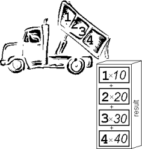

## Matrices
A matrix is just a table of numbers. Here's an example from the wild:

\begin{pmatrix} 
3 & 0 & 4 \\ 
0 & 3 & 5 \\
0 & 0 & 1
\end{pmatrix}

Why do game developers love them so much? They allow us to do useful things to positions and directions!

## Scale Matrix in 2D {.smaller}

You can make vectors bigger, smaller or point the other way with the scale matrix, where $scale_x$ and  $scale_y$ mean the scale along $x$ and $y$:

\begin{pmatrix} 
scale_x & 0 & 0\\ 
0 & scale_y & 0\\ 
0 & 0 & 1 \end{pmatrix}

## Translate Matrix in 2D {.smaller}

You can move positions around using the translation matrix, where $\Delta x$ and $\Delta y$ mean the change in $x$ and $y$:

\begin{pmatrix} 
1 & 0 & \Delta x\\ 
0 & 1 & \Delta y\\ 
0 & 0 & 1 \end{pmatrix}

## Rotation Matrix in 2D {.smaller}

You can rotate vectors using the rotation matrix, where $\theta$ is the angle:

\begin{pmatrix} 
\cos\theta & -\sin\theta & 0 \\ 
\sin\theta & \cos\theta & 0 \\
0 & 0 & 1
\end{pmatrix}

## Dumptruck Method

:::: {.columns}

::: {.column width="55%"}

[Think of a row vector multiplying a column vector:]{.struc}

$$\begin{pmatrix} 1 & 2 & 3 & 4 \end{pmatrix}
\times
\begin{pmatrix} 10\\20\\30\\40 \end{pmatrix}$$

. . .

$$= 1(10) + 2(20) + 3(30) + 4(40)$$

. . .

$$= 300$$

:::

::: {.column width="45%"}
{width="100%"}
:::

::::

## Multiplying a Matrix by a Vector {.smaller}

Use the dumptruck method three times for a 3x3 matrix multiplied with a column vector:

## Directions Don't Translate{.smaller}

Remember that $w$ is zero for a direction? That means it won't translate:

## Multiplying Matrices {.smaller}

Just keep on dumptrucking for multiplying matrices:

## Order Matters {.smaller}
Multiply matrices to combine transformations. But be careful, order matters!

