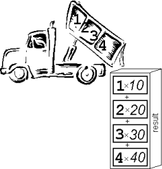

## Matrices
A matrix is just a table of numbers. Here's an example from the wild:

\begin{pmatrix} 
3 & 0 & 0 & 4 \\ 
0 & 3 & 0 & 5 \\
0 & 0 & 1 & -1\\
0 & 0 & 0 & 1
\end{pmatrix}

Why do game developers love them so much? They allow us to do useful things to positions and directions!

## Scale Matrix in 3D

You can make vectors bigger, smaller or point the other way with the scale matrix:

$$\begin{pmatrix}
scale_x & 0 & 0 & 0\\
0 & scale_y & 0 & 0\\
0 & 0 & scale_z & 0\\
0 & 0 & 0 & 1 \end{pmatrix}$$

## Translate Matrix in 3D

You can move positions around using the translation matrix:

\begin{pmatrix} 
1 & 0 & 0 & \Delta x\\
0 & 1 & 0 & \Delta y\\
0 & 0 & 1 & \Delta z\\
0 & 0 & 0 & 1
 \end{pmatrix}

## Rotation Matrix in 3D (pick your axis of rotation)
$$R_x = \begin{pmatrix}
1 & 0 & 0 & 0\\
0 & \cos\theta & -\sin\theta & 0\\
0 & \sin\theta & \cos\theta & 0\\
0 & 0 & 0 & 1 \end{pmatrix}
\quad
R_y = \begin{pmatrix}
\cos\theta & 0 & \sin\theta & 0\\
0 & 1 & 0 & 0\\
-\sin\theta & 0 & \cos\theta & 0\\
0 & 0 & 0 & 1 \end{pmatrix}
\quad
R_z = \begin{pmatrix}
\cos\theta & -\sin\theta & 0 & 0\\
\sin\theta & \cos\theta & 0 & 0\\
0 & 0 & 1 & 0\\
0 & 0 & 0 & 1 \end{pmatrix}$$

## Order Matters 
Multiply matrices to combine transformations. But be careful, order matters!

## Dumptruck Method

:::: {.columns}

::: {.column width="55%"}

[Think of a row vector multiplying a column vector:]{.struc}

$$\begin{pmatrix} 1 & 2 & 3 & 4 \end{pmatrix}
\times
\begin{pmatrix} 10\\20\\30\\40 \end{pmatrix}$$

. . .

$$= 1(10) + 2(20) + 3(30) + 4(40)$$

. . .

$$= 300$$

:::

::: {.column width="45%"}
{width="100%"}
:::

::::

## Multiplying a Matrix by a Vector

Use the dumptruck method four times for a 4x4 matrix multiplied with a 4D column vector:

## The Model Matrix

Just keep on dumptrucking to build the Model Matrix = $TRS$

## Order Matters with Rotations too 

## Directions Don't Translate
Remember that $w$ is zero for a direction? That means it won't translate:

